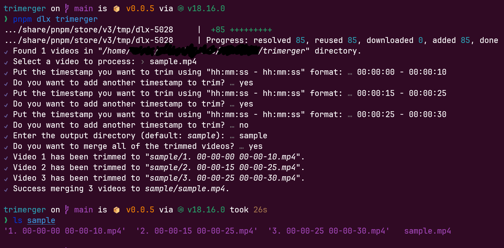

<h1 align="center">Trimerger</h1> 

<p align="center">
  
</p>

<p align="center">
  Easily trim a video using multiple timestamps with FFMPEG.
</p>

<p align="center">
  
  
  
</p>

<hr/>

## Usage

**Important!**

Please run the following command inside the folder where your video is located.

**`NPM`**
```bash
npx trimerger
```

**`PNPM`**
```bash
pnpm dlx trimerger
```

**`Yarn`**
```bash
yarn dlx trimerger
```

## Notes

- Currently `trimerger` only support `.mp4` video.
- The trimming results may not accurate because we don't re-encode the video for performance purpose. The accurate option will be implemented later.